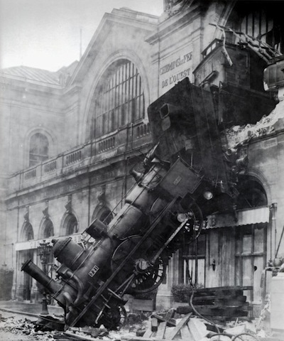

!SLIDE subsection

# Installing Rails 3 #

!SLIDE

## Step 1. Install Dependencies ##

!SLIDE commandline incremental

    $ gem install rails3b
    ... lots of lines ...
    Successfully installed rails3b-3.0.1
    ... more lines ...

!SLIDE

## Step 2. Install The Beta ##

!SLIDE commandline incremental

    $ gem install rails --pre
    ... lines of stuff ...
    Successfully installed rails-3.0.0.beta
    ... more lines ...

!SLIDE

## But if you have rails < 3 installed... ##

!SLIDE center

!SLIDE

### Installation is a pain in the ass. Use RVM / something to manage environments ###

### e.g. RVM ###

!SLIDE

## Or gemset ##

### http://gist.github.com/307257 ###

!SLIDE commandline incremental

## E.g. using default gems: ##

    $ gemset
    Using default gemset.

!SLIDE commandline incremental
    
## Using a named gemset:

    $ gemset rails3
    Using gemset: rails3 (location: '/Users/sutto/.gems-switcher/rails3')

!SLIDE

## That's pretty much it. ##

    